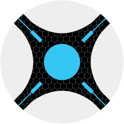

# </img> Sonarr 

Sonarr is a PVR for Usenet and BitTorrent users. It can monitor multiple RSS feeds for new episodes of your favorite shows and will grab, sort and rename them. It can also be configured to automatically upgrade the quality of files already downloaded when a better quality format becomes available.

## Getting Started

- [Download/Installation](https://sonarr.tv/#downloads-v3)
- [FAQ](https://wiki.servarr.com/sonarr/faq)
- [Wiki](https://wiki.servarr.com/Sonarr)
- [(WIP) API Documentation](https://github.com/Sonarr/Sonarr/wiki/API)
- [Donate](https://sonarr.tv/donate)

## Support
Note: GitHub Issues are for Bugs and Feature Requests Only

- [Forums](https://forums.sonarr.tv/)
- [Discord](https://discord.gg/M6BvZn5)
- [GitHub - Bugs and Feature Requests Only](https://github.com/Sonarr/Sonarr/issues)
- [IRC](https://web.libera.chat/?channels=#sonarr)
- [Reddit](https://www.reddit.com/r/sonarr)
- [Wiki](https://wiki.servarr.com/sonarr)

## Features

### Current Features

- Support for major platforms: Windows, Linux, macOS, Raspberry Pi, etc.
- Automatically detects new episodes
- Can scan your existing library and download any missing episodes
- Can watch for better quality of the episodes you already have and do an automatic upgrade. *eg. from DVD to Blu-Ray*
- Automatic failed download handling will try another release if one fails
- Manual search so you can pick any release or to see why a release was not downloaded automatically
- Fully configurable episode renaming
- Full integration with SABnzbd and NZBGet
- Full integration with Kodi, Plex (notification, library update, metadata)
- Full support for specials and multi-episode releases
- And a beautiful UI

## Contributing

### Development
This project exists thanks to all the people who contribute. [Contribute](CONTRIBUTING.md).

### Supporters

This project would not be possible without the support of our users and software providers. 
[**Become a sponsor or backer**](https://opencollective.com/sonarr) to help us out!

#### Mega Sponsors

#### Sponsors

#### Backers

#### JetBrains

Thank you to [ JetBrains](http://www.jetbrains.com/) for providing us with free licenses to their great tools

* [ TeamCity](http://www.jetbrains.com/teamcity/)
* [ ReSharper](http://www.jetbrains.com/resharper/)
* [ dotTrace](http://www.jetbrains.com/dottrace/)

### Licenses

- [GNU GPL v3](http://www.gnu.org/licenses/gpl.html)	
- Copyright 2010-2021
