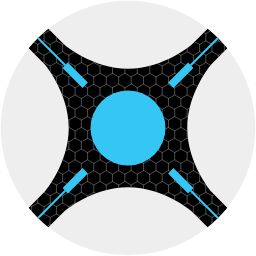

# </img> Sonarr

## Installation

This fork is designed to be a drop-in replacement for existing Sonarr docker installations. Simply replace your sonarr docker image with `ghcr.io/realzombee/sonarr:develop`

Sample docker compose:
```docker
sonarr:
    image: ghcr.io/realzombee/sonarr:develop
    container_name: sonarr
    environment:
      - PUID=1000
      - PGID=1000
      - TZ=Etc/UTC
      # Add env vars for any tweaks you want to enable
      - ACCEPT_RELEASE_ANY_UPGRADABLE=true
      - IGNORE_MATCH_BY_ID_WARNING=true
      - FIX_ANIME_SEASON_SEARCH=true
    volumes:
      - /path/to/sonarr/data:/config
      # Additional volume mounts for your media, etc
    ports:
      - 8989:8989
    restart: unless-stopped
```

## Why this fork?

This fork aims to improve certain aspects of Sonarr to make it work better with remote "infinite" library setups (Debrid/Usenet streaming, etc). This fork will be kept up-to-date with the Sonarr develop branch and the changes in this fork are fully compatible with the original Sonarr configs so you can freely swap back and forth between them.

This fork provides two categories of changes:

## Fixes
 These are universal bug-fixes that should be fixed in the original Sonarr project. These will be submitted as pull requests eventually but might not make it into a general release until the v5 migration is complete.

- ffprobe issues: There's a bug in VideoFileInfoReader that causes ffprobe to read the entire file during HDR analysis if the video stream is at a non-zero index. This is especially problematic for remote files since it uses bandwidth unnecessarily.
- RefreshMonitoredDownloadsCommand: Tools like decypharr and nzbdav issue this command after processing a download. But when this command is issued through the API or through the UI, it has a `Normal` priority, causing a buildup of queue items if lots of searches are triggered at once.

## Tweaks
These are small changes to Sonarr behavior to optimize for debrid/usenet streaming setups. These can be turned on through environment variables. 

#### ACCEPT_RELEASE_ANY_UPGRADABLE

This setting allows Sonarr to download season packs even if it already has some episodes. Generally you should turn this on for debrid setups.

Sonarr does not download season packs if it does not result in an upgrade for ALL episodes in a season. This is a good choice for regular setups where downloads take a long time and downloading a season pack just to upgrade a single episode is not pragmatic. But with "infinite" setups, downloads take seconds. Furthermore, debrid services often expire certain files from a season pack and by default, sonarr doesn't download another season pack to replace it, which can result in Sonarr grabbing a lower quality single episode.

#### IGNORE_MATCH_BY_ID_WARNING

This setting turns off the warning 

```
Found matching series via grab history, but release was matched to series by ID. Automatic import is not possible
``` 

This generally happens on usenet indexers that include a tvdbId in releases that sonarr uses to match against series while downloading. But during imports, if the files are obfuscated or the file/series name doesn't match up with sonarr's expectations, it blocks automatic import. 
 
⚠️ Only use this setting if you trust your indexers to provide the correct tvdbIds when they're present on releases.

#### FIX_ANIME_SEASON_SEARCH

Sonarr's default anime season search is **VERY** slow since it also searches for each episode individually. This setting allows you to bypass that and just search by season, which most indexers support. This significantly improves the search experience for anime.

#### FIX_REPAIR_REIMPORT
⚠️ Testing, not ready for use.

This fixes a bug where Sonarr does not re-import torrents that have been previously deleted and grabbed again. This should be enabled if you use tools like decypharr to repair broken torrents/links.

## Contributing

Feel free to open issues or pull requests for any changes you'd like to see.